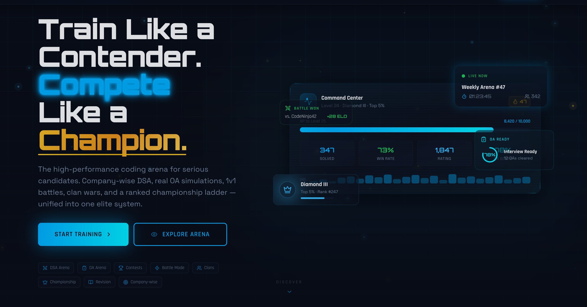
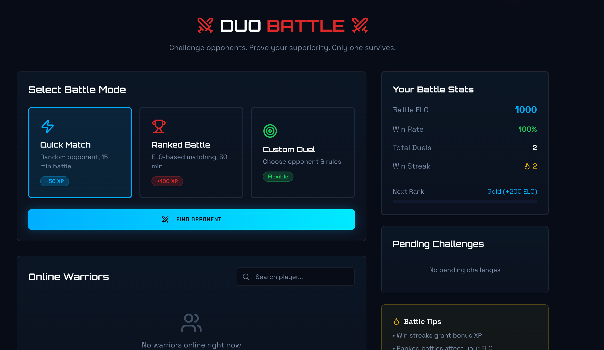
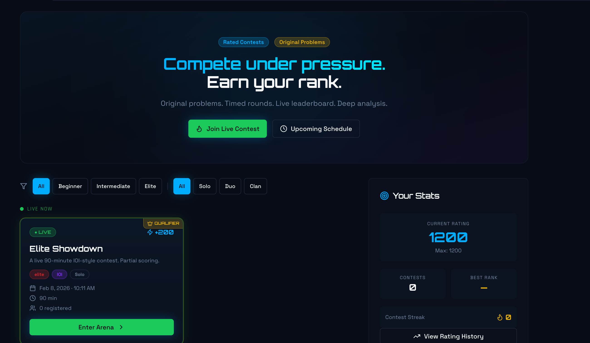
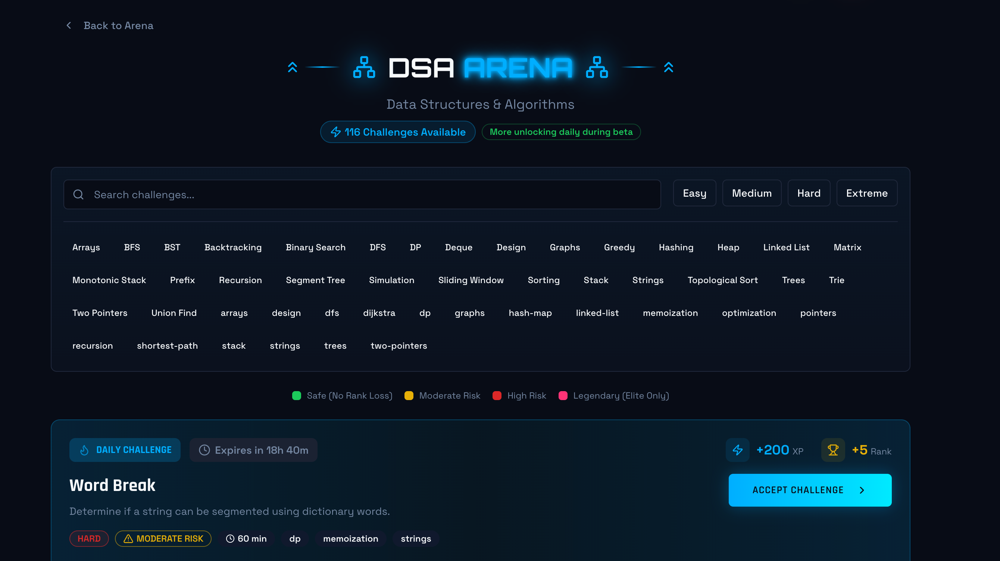
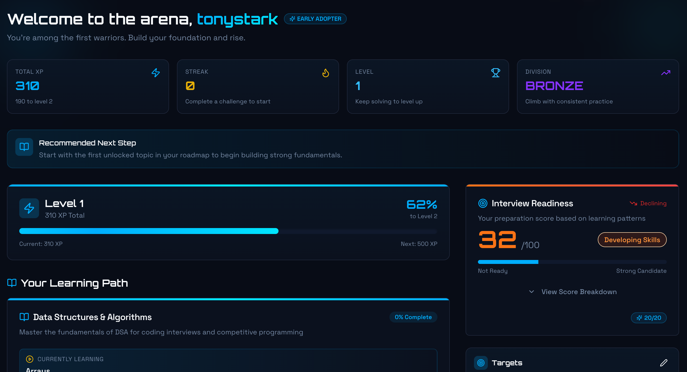

<p align="center">
  
</p>

<p align="center">


</p>

<h1 align="center">CodeTrackX</h1>

<p align="center">
Train like a contender. Compete like a champion.
</p>

---

# 🚀 Overview

**CodeTrackX** is a modern competitive coding platform built to simulate **real technical interview environments**.

Unlike traditional practice platforms, CodeTrackX combines:

* competitive contests
* real-time coding battles
* structured training paths
* clan based collaboration
* company-wise interview preparation

All inside a unified system designed for serious developers.

---

# 🧠 Platform Modules

## ⚔️ Battle Mode

Real-time competitive coding duels.

Modes:

* Quick Match
* Ranked Battle
* Custom Duel

Developers compete under time pressure solving algorithmic problems.



---

## 🏁 Contest Arena

Timed competitive programming contests.

Features:

* Live leaderboard
* Contest rankings
* XP and rating system
* Multi-mode contests (Solo, Duo, Clan)



---

## 🧩 Challenge Arena

Structured training arenas for interview preparation.

Tracks include:

* Data Structures & Algorithms
* System Design
* Low-Level Design
* Machine Coding
* SQL



---

## 🏢 Company-Wise Problems

Practice real interview questions frequently asked by top companies.

Companies include:

* Google
* Meta
* Amazon
* Microsoft
* Apple


---

## 🛡 Clan Arena

Developers can form teams and compete together.

Features:

* Clan creation
* Clan leaderboards
* Weekly clan competitions
* Squad-based progression


---

## 📊 Dashboard

Personalized dashboard that tracks:

* XP
* streaks
* rank
* interview readiness
* learning progress



---

## 🧪 OA Arena

Simulated Online Assessments for interview preparation.

Features:

* timed OA simulations
* integrity tracking
* performance analysis
* company-style assessments


---

# ✨ Features

* Competitive coding battles
* Contest engine with real-time rankings
* Structured interview preparation
* Clan based collaboration
* Company interview practice
* Leaderboards and XP system
* Admin management dashboard
* Supabase powered backend
* Cyber-glass UI design

---

# 🧰 Tech Stack

Frontend

* React / Next.js
* TailwindCSS
* Custom UI components

Backend

* Supabase
* PostgreSQL
* Supabase Realtime

Infrastructure

* Cloudflare Pages (frontend hosting)
* Supabase Storage
* Supabase Edge Functions

---

# 📦 Project Structure

```
codetrackx
│
├── assets
│   ├── banner.jpeg
│   ├── dashboard.png
│   ├── contests.png
│   ├── BATTLE.png
│   ├── Clan Arena.png
│   ├── OA Arena.png
│   ├── COMPANY-WISE PROBLEMS.png
│   └── challenges:dsa.png
│
├── docs
├── src
├── supabase
│
├── README.md
├── CONTRIBUTING.md
├── CODE_OF_CONDUCT.md
├── LICENSE
```

---

# ⚙️ Development Setup

Clone repository

```
git clone https://github.com/Starlord87official/code-arena.git
cd code-arena
```

Install dependencies

```
npm install
```

Create environment file

```
NEXT_PUBLIC_SUPABASE_URL=
NEXT_PUBLIC_SUPABASE_ANON_KEY=
```

Run development server

```
npm run dev
```

---

# 🧪 Admin Panel

CodeTrackX includes an internal **Admin Dashboard** used to manage:

* Users
* Problems
* Contests
* Battles
* Clans
* Notifications
* Championship seasons

Admin access is controlled via Supabase role permissions.

---

# 🗺 Roadmap

Upcoming features:

* AI coding feedback
* Interview simulation engine
* mobile application
* advanced contest rating system
* company interview pipelines

---

# 🤝 Contributing

We welcome contributions from developers worldwide.

Steps:

1 Fork the repository
2 Create a feature branch
3 Commit your changes
4 Submit a Pull Request

See **CONTRIBUTING.md** for full guidelines.

---
## Maintainer Workflow

CodeTrackX is actively maintained and receives feature updates regularly.

Typical maintainer tasks include:

- reviewing pull requests
- debugging issues across multiple modules
- maintaining Supabase database migrations
- writing documentation
- refactoring contest and battle systems

AI-assisted tooling like Codex can significantly improve this workflow by:
- automating code review suggestions
- identifying potential bugs early
- generating documentation for new modules
- assisting contributors during development

---

# 📜 License

This project is licensed under the **MIT License**.

---

# 🌍 Vision

CodeTrackX aims to build a global competitive coding ecosystem where developers can:

* learn
* compete
* collaborate
* grow

together.

## Why CodeTrackX is Open Source

We believe competitive programming infrastructure should be open and transparent.

Most platforms in this space are closed systems.  
CodeTrackX aims to build an open ecosystem where developers can contribute to the future of coding competitions and interview preparation.
