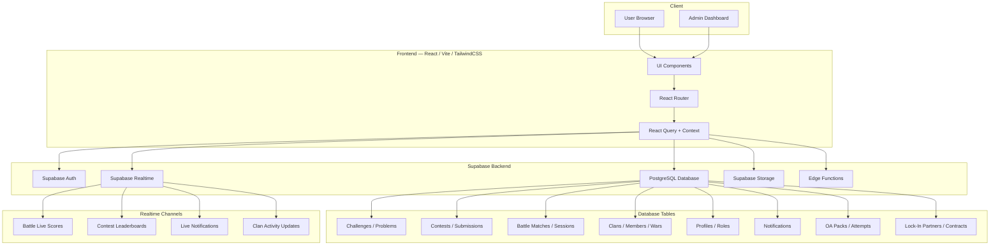
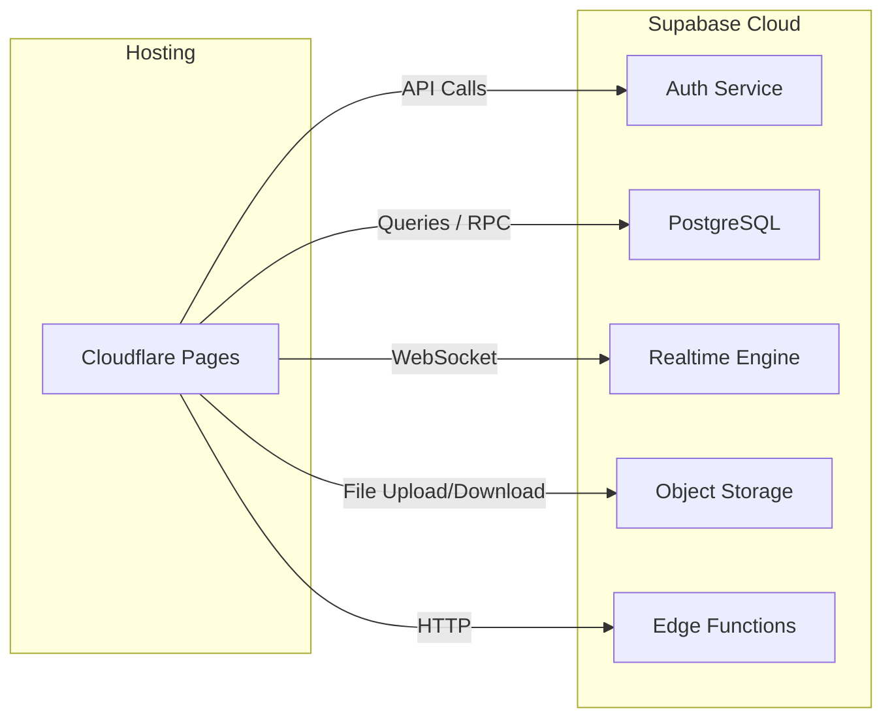

# CodeTrackX Architecture

## Overview

CodeTrackX is a competitive coding platform designed for real technical interview preparation. The system combines structured training, real-time battles, contests, clan collaboration, and online assessment simulation into a unified platform.

The architecture follows a **client-heavy, serverless backend** model — the React frontend communicates directly with Supabase services (Database, Auth, Realtime, Storage) without a custom application server. Backend logic is handled through PostgreSQL functions, triggers, Row Level Security (RLS) policies, and Edge Functions.

---

## System Architecture Diagram

---

## Architecture Layers

### Frontend Layer

- **Framework:** React with Vite and TypeScript
- **Styling:** TailwindCSS with a custom design token system (HSL-based semantic tokens)
- **Routing:** React Router v6 with layout-based route grouping
- **State Management:** TanStack React Query for server state, React Context for auth and role state
- **Component Library:** shadcn/ui components with custom variants

The frontend is a single-page application. All data fetching is done via the Supabase JavaScript SDK, with React Query managing caching, refetching, and optimistic updates.

### Backend Layer

There is no custom application server. Backend logic is implemented through:

- **PostgreSQL Functions (RPC):** Server-side business logic such as battle completion scoring, ELO calculations, and XP awards
- **Database Triggers:** Automatic profile creation on signup, streak tracking, and audit logging
- **Row Level Security (RLS):** Fine-grained access control on every table — users can only read/write data they are authorized to access
- **Edge Functions:** AI insights generation and any logic requiring external API calls

### Database Layer

Supabase PostgreSQL serves as the single source of truth. Key table groups:

| Domain | Tables |
|---|---|
| Users | `profiles`, `user_roles`, `invite_codes` |
| Challenges | `challenges`, `challenge_packs`, `challenge_completions`, `daily_challenge_completions` |
| Contests | `contests`, `contest_problems`, `contest_submissions`, `contest_registrations`, `contest_rating_changes`, `contest_teams` |
| Battles | `battle_matches`, `battle_participants`, `battle_match_problems`, `battle_match_submissions`, `battle_sessions`, `battle_queue`, `battle_invites` |
| Clans | `clans`, `clan_members_v2`, `clan_wars`, `clan_quests`, `clan_announcements`, `clan_applications` |
| OA Arena | `oa_packs`, `oa_questions`, `oa_attempts`, `oa_attempt_answers` |
| Lock-In | `lockin_training_cards`, `lockin_contracts`, `lockin_contract_missions`, `lockin_trials`, `lockin_partner_stats` |
| Social | `friend_requests`, `doubts`, `doubt_comments`, `notifications` |
| Roadmap | `roadmap_topics`, `user_roadmap_progress`, `user_topic_problems`, `revisions` |
| Admin | `ai_settings`, `ai_usage` |

### Realtime Systems

Supabase Realtime is used via PostgreSQL publication subscriptions (`supabase_realtime`). Active realtime channels:

- **Battle Mode:** Live score updates between opponents during a match
- **Contest Arena:** Real-time leaderboard ranking changes
- **Notifications:** Instant delivery of battle invites, friend requests, and clan events
- **Clan Activity:** Live clan chat and activity feed updates

### Authentication

Supabase Auth handles all authentication:

- Email/password signup with email verification (auto-confirm disabled)
- Session persistence via `localStorage`
- Profile creation triggered automatically on signup via database trigger
- Role-based access via a separate `user_roles` table with a `SECURITY DEFINER` helper function (`has_role`) to prevent RLS recursion

### Admin System

The Admin Dashboard is a protected route group (`/admin/*`) that provides management for:

- Users and roles
- Problems and challenge packs
- Contests and scheduling
- Battle configuration
- Clan oversight
- Notification broadcasting
- Championship seasons

Admin access is enforced via the `user_roles` table and server-side role checks.

---

## Major Modules

### Challenge Arena

Structured training across DSA, System Design, Low-Level Design, Machine Coding, and SQL. Challenges are organized into packs with difficulty progression, XP rewards, and completion tracking.

### Battle Mode

Real-time 1v1 coding duels with ELO-based matchmaking. Supports Quick Match, Ranked, and Custom Duel modes. Scores are computed server-side from submissions to prevent manipulation. Battle sessions use row locking for concurrency safety.

### Contest Engine

Timed competitive programming contests supporting Solo, Duo, and Clan modes. Features include live leaderboards, rating changes (ELO-based), integrity monitoring (tab switches, copy-paste tracking), and post-contest reports.

### Clan System

Team-based collaboration with clan creation, membership management, weekly wars, quests, and XP-based progression. Mentor roles allow announcements, class scheduling, and performance monitoring. Strict one-clan-per-student enforcement via database constraints.

### OA Arena

Simulated Online Assessments replicating company interview environments. Features timed sessions, integrity tracking, performance analysis, and company-style assessment packs.

### Lock-In Partner System

Accountability partner matching for structured daily practice. Includes training card profiles, partner contracts with daily missions, duo streaks, and reliability scoring.

---

## Deployment Architecture

| Layer | Service | Purpose |
|---|---|---|
| Frontend Hosting | Cloudflare Pages | Static site hosting with global CDN |
| Authentication | Supabase Auth | User signup, login, session management |
| Database | Supabase PostgreSQL | All application data, RLS, functions, triggers |
| Realtime | Supabase Realtime | WebSocket-based live updates |
| Storage | Supabase Storage | User avatars, file uploads |
| Backend Logic | Supabase Edge Functions | AI insights, external API integrations |

---

## Why This Architecture

**Scalability** — Supabase PostgreSQL scales vertically with managed infrastructure. Realtime channels scale horizontally. No custom server to bottleneck.

**Realtime Competitions** — Supabase Realtime provides native WebSocket support for live battle scores, contest leaderboards, and instant notifications without additional infrastructure.

**Low Infrastructure Cost** — No custom backend servers. Cloudflare Pages provides free static hosting with global CDN. Supabase handles compute, storage, and auth in a single managed service.

**Fast Development** — Direct frontend-to-database communication via the Supabase SDK eliminates API layer boilerplate. RLS policies enforce security at the database level, reducing application-layer auth code.

**Open Source Friendly** — Contributors can run the full stack locally with `supabase start` and `npm run dev`. No complex deployment pipelines or proprietary infrastructure required.
